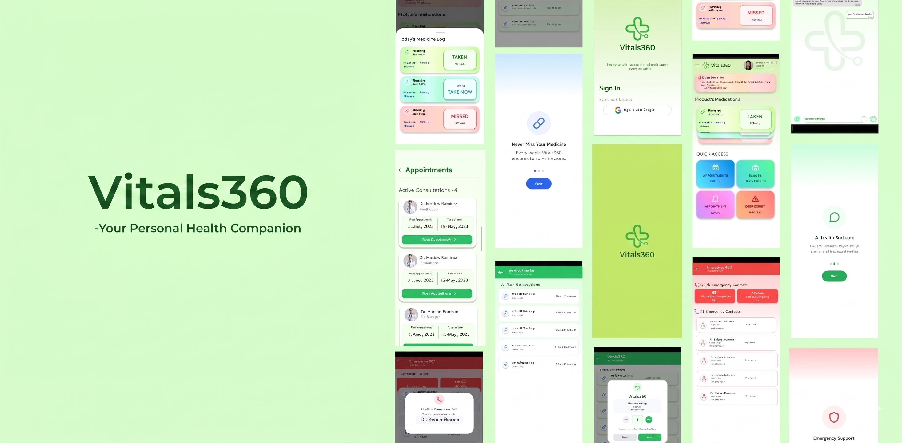

# 💚 Vitals360 – Smart Health Manager
**Crafted with Flutter · Powered by Firebase · Built to Save Lives**

**Vitals360** is your intelligent companion for managing medicines, emergencies, and healthcare data — all in one place. Built for patients, families, and doctors, it simplifies routines, improves medication adherence, and ensures vital information is always accessible, especially in critical situations.

**[Download APK](https://drive.google.com/file/d/1rVQwrURCPrlP7Y_DvHe4vQCnwIANuXC0/view?usp=sharing)**

---

## 📱 App Preview

  

---

## ✨ Key Features

### 🤖 AI Health Assistant (Powered by Gemini/OpenAI)
- 24x7 smart chatbot for instant answers to health-related queries
- Helps users understand symptoms, medications, dosages, and more
- Designed for accessibility and conversational ease
- Built-in support for appointment queries and health awareness

---

### 💊 Smart Medicine Reminders
- Schedule medications by time: Morning / Afternoon / Night
- Get timely **local notifications** — even when app is closed
- Track doses as ✅ Taken, ❌ Missed, ⏳ Pending
- Voice reminders and color-coded indicators for elderly users

---

### 🔄 Refill Management
- Never run out of medicines — get reminders before stock ends
- Pharmacy integration (planned) for **1-click medicine reorders**
- Simple interface to manage refill cycles with medicine status

---

### 📅 Appointment Tracking
- View upcoming medical appointments directly from dashboard
- AI Assistant can guide users on next visits or rescheduling
- Future integration with doctor’s module for auto-sync

---

### 🚨 Emergency SOS System
- One-tap to call 🚑 Ambulance (108), 🚓 Police (100), or your trusted contact
- Emergency contacts saved during setup
- Confirmation popup prevents accidental calls
- Designed with high-contrast colors and large touch zones for quick use

---

### 🧾 Digital Patient Profile (with 6-digit code)
- Generate a unique patient ID to share with doctors instantly
- Profile includes diseases, allergies, medications, and emergency contacts
- Works in both **Patient** and **Doctor** apps for seamless health communication

---

### 🧱 Modular MVVM Architecture
- Clean structure separates UI, logic, and backend
- Easier for team collaboration, feature scaling, and testing

---

## 🛠 Tech Stack

| 🧩 Technology          | 📌 Purpose                                   |
|------------------------|-----------------------------------------------|
| **Flutter + Dart**     | Cross-platform UI and app logic              |
| **Firebase Auth**      | Phone & Google-based authentication          |
| **Firebase Firestore** | Cloud-based patient data storage             |
| **Local Notifications**| Scheduled med reminders                      |
| **SharedPreferences**  | Persistent login state                       |
| **GetX**               | Efficient state management and routing       |
| **OpenAI / Gemini API**| AI-powered health assistant                  |
| **Crypto**             | Secure 6-digit patient ID generation         |
| **Lottie**             | Smooth UI animations                         |
| **Image Picker**       | Upload profile photos                        |
| **URL Launcher**       | Trigger WhatsApp, Calls, and more            |

---

## 🌍 Real-World Impact & Use Cases

### 👵 For Senior Citizens with Chronic Illnesses
Elderly users with diabetes, hypertension, or arthritis can:
- Get **reminders** for multiple medicines per day
- **Call emergency services** or doctors with one tap in emergencies

### 👨‍⚕️ For Doctors & Clinics *(via Dr. Vitals360 App)*
- View patient health records anytime via secure code
- Avoid paper prescriptions and track allergies or history
- Reduces delays in emergency treatment

### 🧠 For General Users
- Chat with the **AI Assistant** about symptoms or medicine usage
- Understand whether to take a medicine before/after meals
- Track whether you’ve taken today’s dose with clear, visual UI

> 📌 Whether you're a patient, a caregiver, or a healthcare provider — **Vitals360** adapts to your role and makes health management easier, safer, and smarter.

## 👨‍💻 Meet Team VitalsPro

A team of passionate developers from **LNCT Bhopal**, committed to transforming how healthcare is accessed, managed, and shared.

| Name | Skills | Institution | 
|------|--------|-------------|
| **Ark Shrivastava** | App Dev · Python · Kotlin · C++ | LNCT Bhopal |
| **Rupal Koghare** | Flutter · UI/UX · C++ · CP | LNCT Bhopal |
| **Riddhima Choubey** | Flutter · C++ | LNCT Bhopal |
| **Rituraj Patidar** | AI/ML · Python · NLP | LNCT Bhopal |

---

Thank you for exploring **Vitals360** – where smart tech meets smart care 💊
